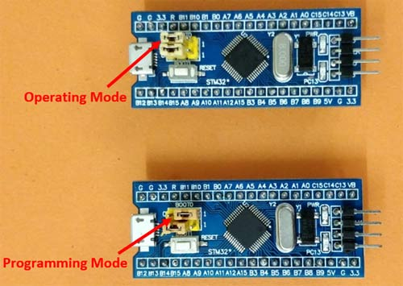
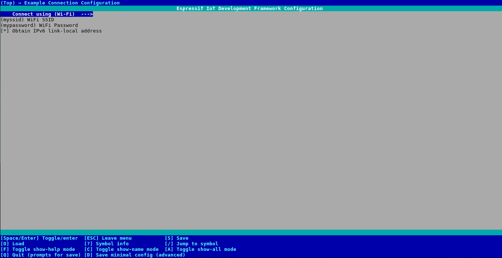
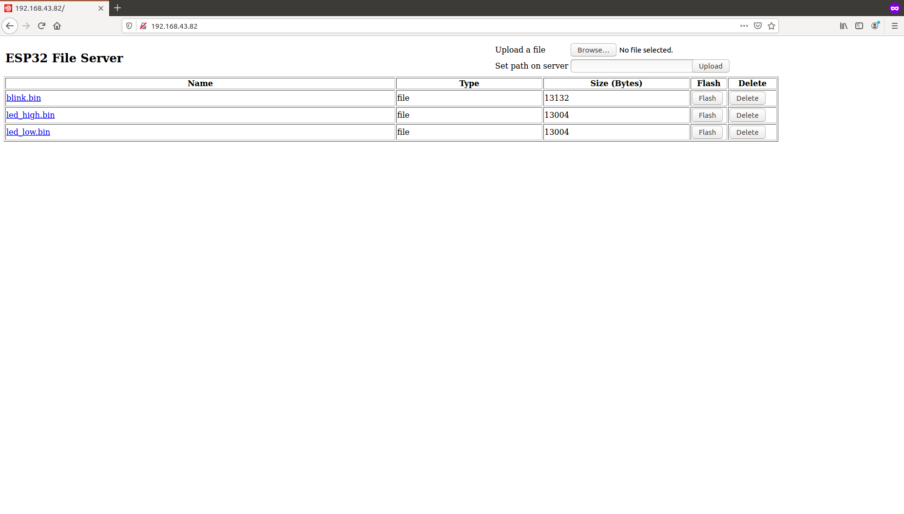

[![Stargazers][stars-shield]][stars-url]
[![Forks][forks-shield]][forks-url]
[![Issues][issues-shield]][issues-url]
[![License][license-shield]][license-url]

<!-- PROJECT LOGO -->
 

  

  <h3 align="center">OTA for STM32Fxx MCU using ESP32</h3>
  

    Program your STM32Fxx Over-the-Air using ESP32
     
    
     
    <a href="https://github.com/laukik-hase/OTA_update_STM32_using_ESP32/">View Code</a>
    ·
    <a href="https://github.com/laukik-hase/OTA_update_STM32_using_ESP32/issues">Report Bug</a>
    ·
    <a href="https://github.com/laukik-hase/OTA_update_STM32_using_ESP32/issues">Request Feature</a>
    ·
    <a href="https://github.com/laukik-hase/OTA_update_STM32_using_ESP32/pulls">Create a Pull Request</a>
  

<!-- TABLE OF CONTENTS -->
## Table of Contents

- [Table of Contents](#table-of-contents)
- [About the Project](#about-the-project)
  - [Code](#code)
- [Getting Started](#getting-started)
  - [Hardware Required](#hardware-required)
  - [Prerequisites](#prerequisites)
  - [Setting Up](#setting-up)
  - [Disclaimer](#disclaimer)
- [Usage (For STM32 Blue Pill)](#usage-for-stm32-blue-pill)
- [Compatibility](#compatibility)
- [Troubleshooting](#troubleshooting)
- [Contributors](#contributors)
- [Acknowledgements and Resources](#acknowledgements-and-resources)
- [License](#license)

## About the Project

The project aims at enabling firmware update of STM32Fxx and STM32Gxx series MCUs Over-the-Air using ESP32.

Testing was done with ESP32-DevKitC v4 board and STM32F103C8T6 ([Blue Pill](https://www.st.com/en/microcontrollers-microprocessors/stm32f103.html)), [STM32F072C8T6](https://www.st.com/en/microcontrollers-microprocessors/stm32f072c8.html) and STM32G431KB ([NUCLEO-G431KB](https://www.st.com/en/evaluation-tools/nucleo-g431kb.html)). You can try with any other STM32Fxx/STM32Gxx MCUs and let us know how it worked out.

### Code

`/esp_stm_flash` -> Basic flashing utility, requires path of the .bin file which has been already uploaded in SPIFFS

`/file_serving_stm` -> OTA demo, with HTTP File Server with embedded flash link

`/references` -> Python scripts for understanding the flashing protocol commands and verification

## Getting Started

### Hardware Required

To run the OTA demo, you need an ESP32 dev board (e.g. ESP32-WROVER Kit) or ESP32 core board (e.g. ESP32-DevKitC). For the STM32, you can use the STM32 Blue Pill.

### Prerequisites

* **ESP-IDF v4.0 and above**

  You can visit the [ESP-IDF Programmming Guide](https://docs.espressif.com/projects/esp-idf/en/latest/get-started/index.html#installation-step-by-step) for the installation steps.

* **Arduino IDE**

  Arduino IDE provides with an easy way to generate the **.bin** files for your STM32 MCU. For setting up Arduino Core for the STM32 family, you can follow this [link](https://circuitdigest.com/microcontroller-projects/getting-started-with-stm32-development-board-stm32f103c8-using-arduino-ide).

  You can also use [**CubeIDE**]((https://stackoverflow.com/questions/57017703/how-do-i-generate-a-binary-file-of-the-stm32-code)) or [**Keil**](https://www2.keil.com/stmicroelectronics-stm32) for generation of **.bin** files.

### Setting Up

1. Wire your STM32 (e.g. Blue Pill) to the ESP32 as follows:

    | ESP32     | STM32    |
    |-----------|----------|
    | GPIO4(TX) | PA10(RX) |
    | GPIO5(RX) | PA9(TX)  |
    | GPIO19    | RESET    |
    | GND       | GND      |

2. Generate a  **.bin** file for the STM32 MCU code you want to flash.

### Disclaimer

We have assumed that the STM32 is already in boot mode before flashing the code (**Step 1 & 5** in [Usage](#usage-for-stm32-blue-pill) section). You can use a MOSFET as a switch to automate the process, using an ESP32 GPIO as an input.

The program code uses only the path of the binary file to be flashed as a parameter. Thus, it can be easily integrated into any other projects as the file can be sent to ESP32 over any protocol (MQTT, HTTP Client, WebSockets).

Read carefully the Boot Mode Procedure ([AN2606](https://www.st.com/content/ccc/resource/technical/document/application_note/b9/9b/16/3a/12/1e/40/0c/CD00167594.pdf/files/CD00167594.pdf/jcr:content/translations/en.CD00167594.pdf)) and the USART protocol used in Bootloader Mode ([AN3105](https://www.st.com/content/ccc/resource/technical/document/application_note/51/5f/03/1e/bd/9b/45/be/CD00264342.pdf/files/CD00264342.pdf/jcr:content/translations/en.CD00264342.pdf)) in order to deeply understand how to use this project with other STM32 microcontrollers.

## Usage (For STM32 Blue Pill)

1. Make sure the BOOT0 jumper pin on the board is set to 1 (programming mode) while uploading the code. Once the code is flashed this pin can be changed back to initial position (operating mode). This procedure with your STM32Fxx MCU varies according with your MCU version.

      Refer this [documentation](https://www.st.com/content/ccc/resource/technical/document/application_note/b9/9b/16/3a/12/1e/40/0c/CD00167594.pdf/files/CD00167594.pdf/jcr:content/translations/en.CD00167594.pdf) for help.

  

    <kbd></kbd>
  

2. Open the project configuration menu (`idf.py menuconfig`) go to `Example Connection Configuration` ->
    1. WiFi SSID: WiFi network to which your PC is also connected to.
    2. WiFi Password: WiFi password

  

    <kbd></kbd>
  

3. In order to test the OTA demo -> `/file_serving_stm` :
    1. Compile and burn the firmware `idf.py -p PORT -b BAUD flash`
    2. Run `idf.py -p PORT monitor` and note down the IP assigned to your ESP module. The default port is 80.
    3. Test the example interactively on a web browser (assuming IP is 192.168.43.82):
        * Open path `http://192.168.43.82/` to see an HTML web page with list of files on the server (initially empty)
        * Use the file upload form on the webpage to select and upload a .bin file to the server
        * Click a file link to download / open the file on browser (if supported)
        * Click the delete link visible next to each file entry to delete them
        * Click on the flash link to flash the .bin code file uploaded to the connected STM32.

  

    <kbd></kbd>
  

4. After clicking the flash link, you should get the following results - 

  

      
  

5. **Revert** the BOOT0 pin to its initial position and press the RESET Button on the STM32.
6. Voila! your STM32 is now running the code you uploaded Over-the-Air!

## Compatibility
According to STM documentation, this project could be compatible with a wide range of microcontrollers, **prior to some customization**:
- **STM32F0 Series (verified)**
- **STM32F1 Series (verified)**
- STM32F2 Series
- STM32F3 Series
- STM32F4 Series
- STM32F7 Series
- STM32G0 Series
- **STM32G4 Series (verified)**
- STM32H7 Series
- STM32L0 Series
- STM32L1 Series
- STM32L4 Series
- STM32L5 Series
- STM32U5 Series
- STM32WB Series
- STM32WL Series

## Troubleshooting

* Check your wiring. Make sure that the ESP32 and STM32 are powered separately. Don't power one MCU using the other.
* Verify your WiFi SSID and password.
* Check if your STM32 is locked using this [official tool](https://www.st.com/en/development-tools/flasher-stm32.html) by STMicroelectronics and unlock it by erasing the memory of your chip.
* Check your STM32 code, which generated the .bin file, for any 'logical' errors.
* For any other bugs or errors, you can always raise [issues](https://github.com/laukik-hase/OTA_update_STM32_using_ESP32/issues).

## Contributors

* [**laukik-hase**](https://github.com/laukik-hase)

* [**udit7395**](https://github.com/udit7395)

**For OTA updates for AVR MCUs, you can follow this [project](https://github.com/laukik-hase/OTA_update_AVR_using_ESP32/).**

## Acknowledgements and Resources

* STM32 USART Protocol: [Documentation](https://www.st.com/content/ccc/resource/technical/document/application_note/51/5f/03/1e/bd/9b/45/be/CD00264342.pdf/files/CD00264342.pdf/jcr:content/translations/en.CD00264342.pdf)

* Python Script: [stm32loader.py](https://github.com/espruino/Espruino/blob/master/scripts/stm32loader.py)

* STM32 Boot Mode Procedure: [Documentation](https://www.st.com/content/ccc/resource/technical/document/application_note/b9/9b/16/3a/12/1e/40/0c/CD00167594.pdf/files/CD00167594.pdf/jcr:content/translations/en.CD00167594.pdf)

* [ESP-IDF Examples - HTTP File Server](https://github.com/espressif/esp-idf/tree/master/examples/protocols/http_server/file_serving)

* [README Template](https://github.com/roshanlam/ReadMeTemplate) by [roshanlam](https://github.com/roshanlam)

* [HackerNews Article: Updating STM32 Over-The-Air using ESP32](https://news.ycombinator.com/item?id=23302664)

* [Reddit Post: Update STM32 Over-the-Air using ESP32](https://www.reddit.com/r/esp32/comments/jx399y/update_stm32_overtheair_using_esp32/)

## License

Distributed under the MIT License. See `LICENSE` for more information.

<!-- MARKDOWN LINKS & IMAGES -->

[forks-shield]:https://img.shields.io/github/forks/laukik-hase/OTA_update_STM32_using_ESP32
[forks-url]: https://github.com/laukik-hase/OTA_update_STM32_using_ESP32/network/members

[stars-shield]: https://img.shields.io/github/stars/laukik-hase/OTA_update_STM32_using_ESP32
[stars-url]: https://github.com/laukik-hase/OTA_update_STM32_using_ESP32/stargazers

[issues-shield]: https://img.shields.io/github/issues/laukik-hase/OTA_update_STM32_using_ESP32
[issues-url]: https://github.com/laukik-hase/OTA_update_STM32_using_ESP32/issues

[license-shield]: https://img.shields.io/github/license/laukik-hase/OTA_update_STM32_using_ESP32
[license-url]: https://github.com/laukik-hase/OTA_update_STM32_using_ESP32/blob/master/LICENSE
